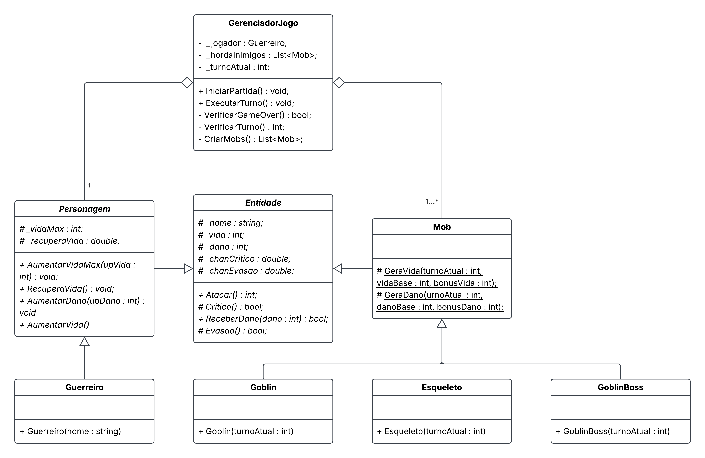

# ⚔️ Mini RPG de Terminal

Um jogo de combate por turnos desenvolvido em **C#** via Console App, focado em sobrevivência, progressão contínua, mecânicas de sorte crítica (RNG) e gerenciamento de hordas com múltiplos inimigos simultâneos.

---

## 🚧 Status do Projeto

Em desenvolvimento ativo. As classes de domínio (personagem, mobs, factories e o `GerenciadorJogo`) já implementam toda a lógica de combate, evolução e escalonamento de inimigos. O `Main` já executa um ciclo real de combate (ataques trocados, verificação de crítico, checagem de game over e avanço de turno), mas ainda como um cenário fixo de teste — o menu completo (`Menu()`, `CriarPersonagem()`) ainda não está integrado a esse fluxo.

---

## 📑 Sobre o Projeto

O objetivo do jogador é sobreviver ao maior número de turnos possível. O jogo conta com um sistema de evolução por sorte (RNG), progressão baseada em ciclos de 5 turnos e combates estratégicos contra hordas que ficam progressivamente mais resistentes e populosas. O projeto adota os princípios de Orientação a Objetos (POO), herança, polimorfismo e o padrão de projeto **Factory Method** para a criação de personagens e inimigos.

---

## 🛡️ Classe Inicial: Guerreiro

O Guerreiro é a classe inicial jogável que herda de `Personagem`:

- **Vida Máxima Inicial:** 40 HP.
- **Dano Base:** 7 (calcula um valor dinâmico entre `max(1, Dano - 3)` e `Dano` a cada ataque).
- **Recuperação Base:** Restaura 50% da vida máxima quando todos os inimigos do turno são derrotados.
- **Atributos Especiais:**
  - **Chance de Crítico (`_chanCritico`):** 10% de chance de dobrar o dano final desferido.
  - **Chance de Evasão (`_chanEvasao`):** 5% de chance de esquiva completa de um golpe recebido.

---

## ⚖️ Mecânicas de Jogo & Escalabilidade

- **Evolução do Jogador:** O jogador escolhe entre aprimorar **Vida Máxima** ou **Dano** (`EscolherBonus`). O valor base é **+2**, com chances de sorte crítica (*RNG*):
  - **Ganho Padrão:** +2 (Base)
  - **Sorte Rara (5% de chance - `0.05`):** +3
  - **Sorte Lendária (0.01% de chance - `0.0001`):** +4

- **Regeneração de Vida:** Ao derrotar todos os inimigos de um turno, o personagem tenta recuperar vida:
  - **Padrão:** Restaura **50% da Vida Máxima**.
  - **Cura Milagrosa (0.01% de chance - `0.0001`):** Restaura **100% da Vida Máxima**!

- **Identidade e Escalonamento dos Inimigos:**
  - 👺 **Goblin (Tank):** Foco em evasão (20%). Vida base 15 (+8 por ciclo), dano base 3 (+4 por ciclo), 10% de crítico.
  - 💀 **Esqueleto (Ataque/DPS):** Foco em dano. Vida base 25 (+5 por ciclo), dano base 6 (+7 por ciclo), 5% de crítico e 10% de evasão.
  - 👑 **Goblin Hero (Chefe):** Surge sozinho a cada turno múltiplo de 5, substituindo a horda comum daquele turno. Vida base 50 (+10 por ciclo), dano base 10 (+5 por ciclo), 15% de crítico e 25% de evasão.
  - A vida e o dano de todos os mobs escalam tanto pelo **ciclo de 5 turnos** em que se encontram quanto pela posição dentro do ciclo (`GeraVida` / `GeraDano`), ficando progressivamente mais difíceis.

- **Multiplicação de Inimigos (Horda):** Fora dos turnos de chefe, a quantidade de inimigos simultâneos cresce a cada 10 turnos, com um teto de **5 monstros por combate**.

- **Recompensa de Chefe:** 🎁 Ao derrotar o Goblin Hero, o personagem recebe **ambos os aprimoramentos no mesmo turno** (+Vida Máxima E +Dano), aplicados via `BonusDerrotaBoss()`.

---

## 👾 Elenco de Inimigos

- **Monstros Comuns:** 💀 **Esqueleto** e 👺 **Goblin**.
- **Chefe (a cada 5 turnos):** 👑 **Goblin Hero** — substitui a horda comum e concede o maior desafio do ciclo.

---

## 📐 Estrutura de Classes (UML)



> ℹ️ O diagrama reflete a v1 do projeto. As classes de `Factory` (`PersonagemFactory`, `MobFactory`) foram adicionadas posteriormente e ainda não constam na imagem.

### `Entidade` (Classe Abstrata Base)
Classe fundamental que centraliza os atributos e regras de combate compartilhados por todas as criaturas do jogo.
- **Atributos Protegidos (`protected`):**
  - `_nome : string`
  - `_vida : int`
  - `_dano : int`
  - `_chanCritico : double`
  - `_chanEvasao : double`
- **Métodos:**
  - `Atacar() : (int dano, bool critico)` — Calcula o dano base, indicando também se o golpe foi crítico (e, nesse caso, dobrando o valor).
  - `ReceberDano(dano : int) : bool` — Processa o dano recebido após testar a evasão (retorna `true` se foi atingido ou `false` se desviou).
  - `Vida : int` / `Nome : string` — Propriedades somente leitura expondo o estado da entidade.
  - `ToString() : string` — Retorna os dados formatados da entidade via `StringBuilder`, delegando trechos específicos para os métodos virtuais `AdicionarNome`, `AdicionarClass` e `AdicionarMaxHp`.

---

### 🛡️ Hierarquia do Jogador

#### `Personagem : Entidade` (Classe Abstrata de Heróis)
Especialização de `Entidade` voltada exclusivamente para o jogador, contendo mecânicas de sustentação e evolução contínua.
- **Atributos Protegidos (`protected`):**
  - `_Class : string`
  - `_vidaMax : int`
  - `_recuperaVida : double`
  - `_CuraMilagrosa : double` (0.0001)
- **Métodos:**
  - `RecuperarVida() : (bool Recuperou, int Cura)` — Regenera a vida atual com base em `_recuperaVida`, ou 100% em caso de cura milagrosa.
  - `AumentarVida(upVida : int) : bool` — Incrementa a vida máxima do personagem.
  - `AumentarDano(upDano : int) : bool` — Incrementa o dano base do personagem.

#### `Guerreiro : Personagem` (Classe Filha)
- **Construtor:** `Guerreiro(nome : string)` — Inicializa os atributos base (40 HP, 7 Dano, 10% Crítico, 5% Evasão e 50% de Recuperação).
- **Métodos:**
  - `Atacar() : (int dano, bool critico)` — Sobrescreve o método sorteando um valor entre `max(1, _dano - 3)` e `_dano`, dobrando o valor e sinalizando `critico = true` quando o golpe crítico ocorre.

---

### 👾 Hierarquia dos Monstros

#### `Mob : Entidade` (Classe Abstrata dos Inimigos)
Especialização de `Entidade` para criaturas hostis, centralizando os cálculos matemáticos de escalonamento.
- **Construtor:** `Mob(nome : string, vida : int, dano : int, chanCritico : double, chanEvasao : double)`
- **Métodos Protegidos Estáticos:**
  - `GeraVida(turnoAtual : int, vidaBase : int, bonusVida : int) : int` — Calcula a vida escalonada por ciclo de 5 turnos e pela posição dentro do ciclo.
  - `GeraDano(turnoAtual : int, danoBase : int, bonusDano : int) : int` — Calcula o dano progressivo por ciclo.

#### `Goblin : Mob` (Classe Filha)
- **Construtor:** `Goblin(turnoAtual : int)` — Instancia um monstro focado em evasão (20%), com vida e dano escalonados por ciclo.

#### `Esqueleto : Mob` (Classe Filha)
- **Construtor:** `Esqueleto(turnoAtual : int)` — Instancia um monstro equilibrado e ofensivo (25 HP Base, 6 Dano Base).

#### `GoblinHero : Mob` (Classe Filha - Chefe)
- **Construtor:** `GoblinHero(turnoAtual : int)` — Instancia o chefe da horda com vida e dano elevados (50 HP Base, 10 Dano Base).

---

### 🏭 Factories

#### `PersonagemFactory`
- `CriarPersonagem(tipo : string, nome : string) : Personagem` — Instancia o personagem correto a partir do tipo informado (atualmente suporta `"Guerreiro"`).

#### `MobFactory`
- `CriarMob(tipo : string, turno : int) : Mob` — Instancia o mob correto (`"Goblin"`, `"Esqueleto"` ou `"Goblin Hero"`) a partir do tipo e do turno atual.

---

### 🎮 Controle de Jogo

#### `GerenciadorJogo` (Controlador da Partida)
Responsável por gerenciar o ciclo de vida do jogo, agregação das entidades e execução dos turnos.
- **Atributos Privados (`private`):**
  - `_personagem : Personagem`
  - `_hordaInimigo : List<Mob>`
  - `_turno : int`
- **Métodos:**
  - `EscolherBonus(escolha : string) : int` — Aplica o bônus de evolução (vida ou dano) escolhido pelo jogador e retorna os pontos ganhos.
  - `BonusDerrotaBoss() : (int vida, int dano)` *(privado)* — Concede os dois aprimoramentos (vida e dano) de uma vez, usado ao derrotar o Goblin Hero.
  - `CriarMobs() : int` — Avança o turno e instancia os inimigos correspondentes (horda comum ou o Goblin Hero nos turnos de chefe), retornando a quantidade de mobs comuns criados.
  - `AtacarMob() : (bool Acertou, int Dano, bool Critico)` — Executa o ataque do jogador contra o primeiro mob da horda.
  - `AtacarPersonagem() : (bool Acertou, int Dano, bool Critico)` — Executa o ataque do primeiro mob da horda contra o jogador.
  - `VerificarMobDerrotado() : Mob?` — Verifica se o mob no topo da horda foi derrotado; em caso positivo, o remove da lista e o retorna (caso contrário, retorna `null`).
  - `TurnoCompleto(nome : string) : bool` — Verifica se a horda ficou vazia após a remoção de um mob; em caso positivo, concede a recompensa dupla (`BonusDerrotaBoss()`) quando `nome` for `"Goblin Hero"` e retorna `true`.
  - `TurnoConcluido() : bool` — Verifica se a horda foi totalmente derrotada e, em caso positivo, aciona a recuperação de vida do jogador.
  - `VerificarGameOver() : bool` — Retorna `true` caso o HP do jogador seja `≤ 0`.
  - `Turno`, `NomePersonagem`, `Personagem`, `HordaInimigo` — Propriedades de leitura para o estado atual da partida.

---

## 🛠️ Tecnologias Utilizadas

* **Linguagem:** C#
* **Plataforma:** .NET 10.0
* **Ambiente:** Console Application

---

## 🚀 Como Executar o Projeto

### Pré-requisitos
* [.NET SDK 10.0+](https://dotnet.microsoft.com/download) instalado.

### Passo a Passo

1. **Clone o repositório:**
   ```bash
   git clone https://github.com/Leonardo-Leonhardt/Micro-RPG.git
   ```

2. **Acesse a pasta do projeto:**
   ```bash
   cd Micro-RPG/Micro_RPG
   ```

3. **Restaure as dependências:**
   ```bash
   dotnet restore
   ```

4. **Execute o jogo:**
   ```bash
   dotnet run
   ```

---

## 📂 Estrutura de Pastas

```
Micro-RPG/
├── docs/
│   └── diagramas/
│       └── diagrama-classes-v1.png
└── Micro_RPG/
    ├── Controllers/
    │   └── GerenciadorJogo.cs
    ├── Models/
    │   ├── Entidade.cs
    │   ├── Factory/
    │   │   ├── PersonagemFactory.cs
    │   │   └── MobFactory.cs
    │   ├── Mobs/
    │   │   ├── Mob.cs
    │   │   ├── Goblin.cs
    │   │   ├── Esqueleto.cs
    │   │   └── GoblinHero.cs
    │   └── Personagens/
    │       ├── Personagem.cs
    │       └── Guerreiro.cs
    ├── Program.cs
    └── Micro_RPG.csproj
```

---

## 🗺️ Roadmap

- [x] Corrigir o valor inicial do contador de turnos (`_turno` começava em 25 por engano; agora começa em 0)
- [x] Fazer `Atacar()` informar se o golpe foi crítico, para uso na exibição do combate
- [ ] Integrar o menu (`Menu`, `CriarPersonagem`) ao ciclo de combate já funcional no `Main`
- [ ] Adicionar novas classes jogáveis além do Guerreiro
- [ ] Adicionar testes automatizados para as regras de combate e escalonamento
- [x] Adicionar Drop Duplo: o jogador recebe ambos os aprimoramentos (+HP Máximo E +Dano) ao derrotar o Goblin Hero
- [ ] Atualizar o diagrama de classes com as factories

---

## 📄 Licença

Este projeto ainda não possui uma licença definida.